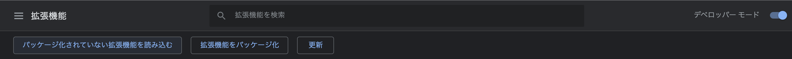
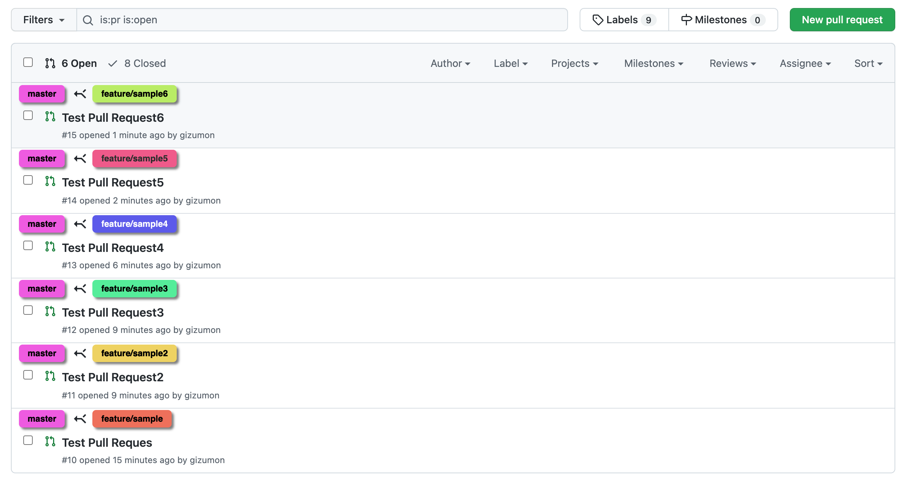
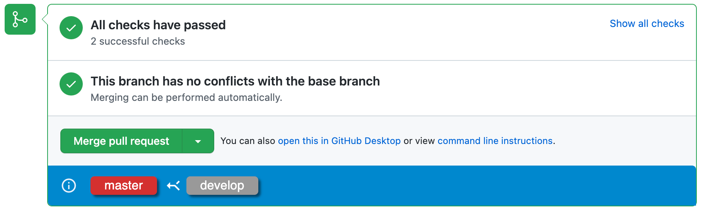
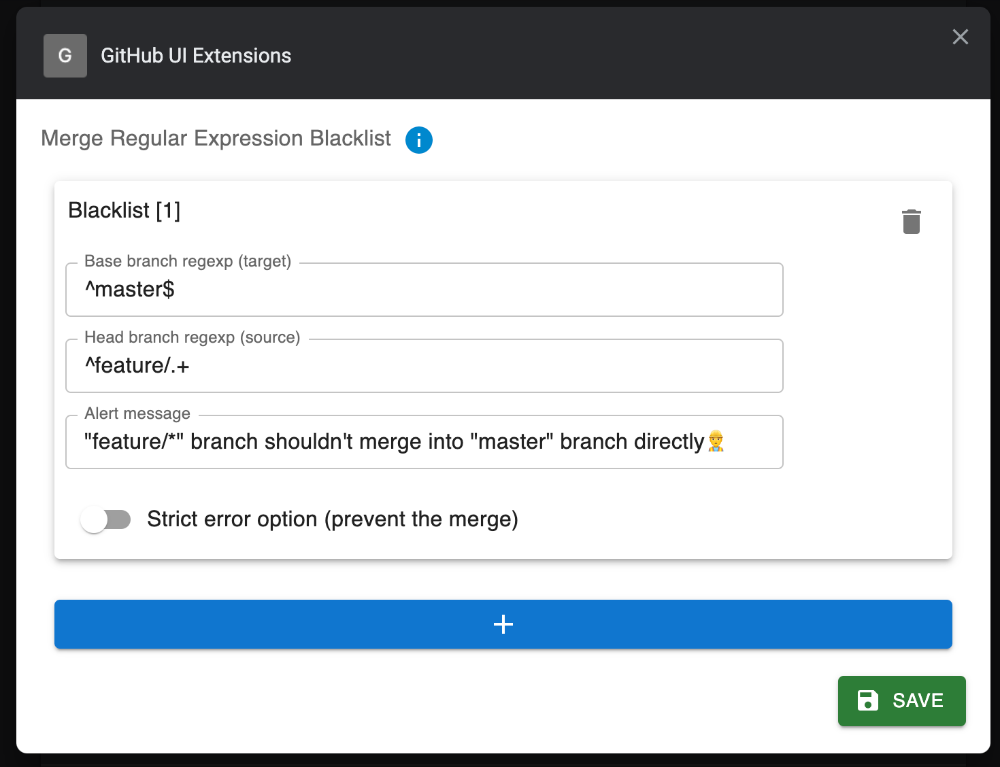
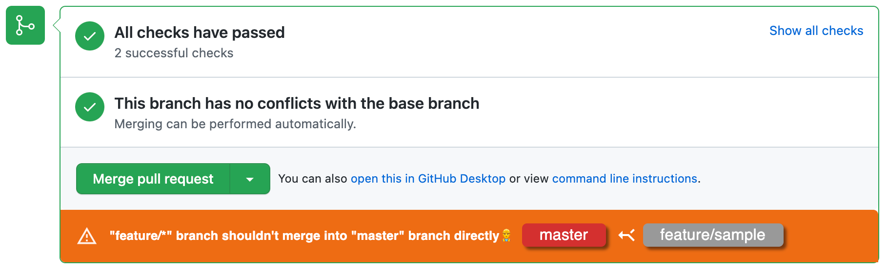
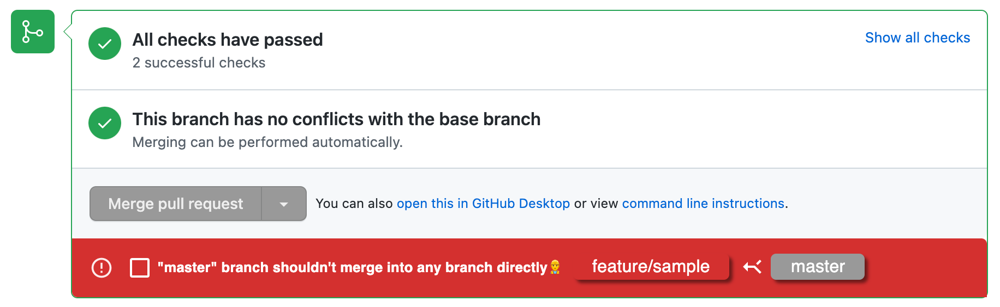
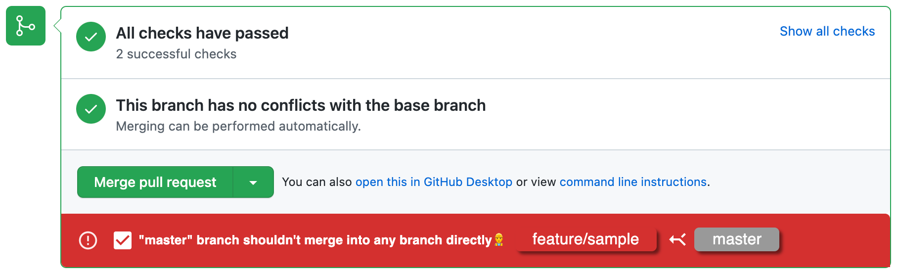

# GitHub UI Extensions


Chrome Extension for GitHub (Support GitHub Enterprize)

## How to install

<details><summary>From GitHub</summary>

* Clone this repo

    ```bash
    git clone https://github.com/gizumon/github-ui-extentions.git
    ```

* Build

    ```bash
    # cd working directory
    cd github-ui-extentions
    npm run build # required nodejs
    ```

* Load build package into Chrome
  * Access Extension in Chrome.
    * chrome://extensions/
  * Click "load extensions"
    * 

</details>

<details><summary>From Chrome Web Store</summary>

* Please find [here](https://chrome.google.com/webstore/detail/github-ui-extensions/lkjhfgipjjdhohlhbmjkjhiddekipcco?hl=ja&authuser=0)

</details>

## Features

### Display Base / Head branch in Pull Request list page



### Display Base / Head branch in Pull Request detail page

You can check base / head branch before you merge Pull Request.



### Regular Expression Branch Rule validation

You can set validations along with your branch rule from extension options.



Based on the setting, this extension will validate the branch rule and raise an alert in the bottom of a merge button.



If you set a validation as a strict mode, then merge button will be disabled and prevent from the unintended merge.



If click the check box, then the merge button will unlock.



## For developers

<details><summary>click here</summary>

## Prerequisites

* [node + npm](https://nodejs.org/) (Current Version)

## Option

* [Visual Studio Code](https://code.visualstudio.com/)

## Includes the following

* TypeScript
* Webpack
* React
* Jest
* Example Code
    * Chrome Storage
    * Options Version 2
    * content script
    * count up badge number
    * background

## Project Structure

* src/typescript: TypeScript source files
* src/assets: static files
* dist: Chrome Extension directory
* dist/js: Generated JavaScript files

## Setup

### Install dependencies

```
npm install
```

### Build

```
npm run build
```

* Build in watch mode
  
    ```
    npm run watch
    ```

## Load extension to chrome

Load `./dist` directory

## Test
`npx jest` or `npm run test`

</details>
