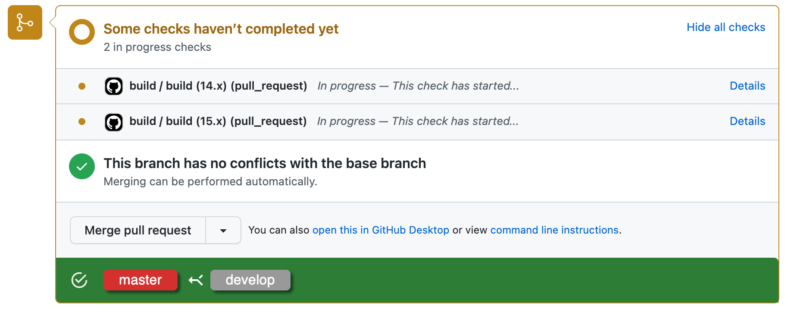

# GitHub UI Extensions


Chrome Extension for GitHub (Support GitHub Enterprize)

## features

### Display Base / Head branch in PR

You can check base / head branch before you merge Pull Request.



### Regular Expression Branch Rule validation

You can set validations along with your branch rule from extension options.


Based on the setting, this extension will validate the branch rule and raise an alert in the bottom of a merge button.


If you set a validation as a strict mode, then merge button will be disabled and prevent from the unintended merge.


## For developers

<details><summary>click here</summary>

## Prerequisites

* [node + npm](https://nodejs.org/) (Current Version)

## Option

* [Visual Studio Code](https://code.visualstudio.com/)

## Includes the following

* TypeScript
* Webpack
* React
* Jest
* Example Code
    * Chrome Storage
    * Options Version 2
    * content script
    * count up badge number
    * background

## Project Structure

* src/typescript: TypeScript source files
* src/assets: static files
* dist: Chrome Extension directory
* dist/js: Generated JavaScript files

## Setup

### Install dependencies

```
npm install
```

### Build

```
npm run build
```

* Build in watch mode
  
    ```
    npm run watch
    ```

## Load extension to chrome

Load `./dist` directory

## Test
`npx jest` or `npm run test`

</details>
